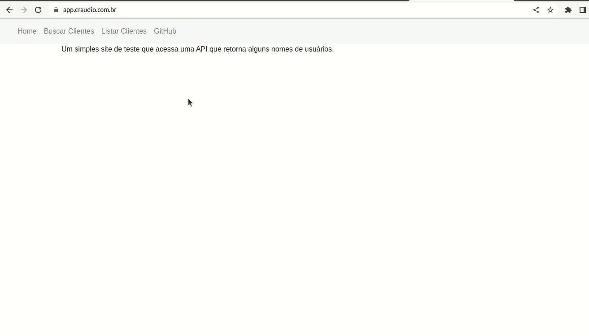

# Web App
## ecs + s3 + cloudfront + route53

Projeto que provisiona uma infraesturua na AWS e serve uma aplicação frontend pelo S3 e um backend pelo ECS

:warning: **ATENÇÃO Este projeto gera custos na AWS** :warning:

## Demo 

  

## Features

- Infraestrutura na AWS
- Deploy de nova task no ECS
- Deploy de arquivos no S3 e remoção do cache do CloudFront

## Como utilizar

### Pré requisitos

- AWS CLI - [Instalação](https://pypi.org/project/awscli/) 
- Terraform - [Instalação](https://developer.hashicorp.com/terraform/tutorials/aws-get-started/install-cli) 
- jq (para o ecs-deploy) - [Instalação](https://jqlang.github.io/jq/download/)

Para construir a infraestrutura e posteriormente utilizar os scripts de build e deployment, siga os arquivos de documentação listados abaixo em ordem. 

- [Provisionamento infraestutura](/infra/aws/readme.md)
- [Deployment Backend](.infra/pipeline-scripts/backend/readme.md)
- [Deployment Frontend](/infra/pipeline-scripts/frontend/readme.md)

## Fluxogramas

## Considerações 

Este projeto tem como objetivo treinar e praticar algumas ferramentas e tecnicas. Seu principal objetivo são estudos. 

## Como contribuir

Existem diversos pontos de melhoria portanto fique a vontade de enviar sua sugestão e afins via PR.
